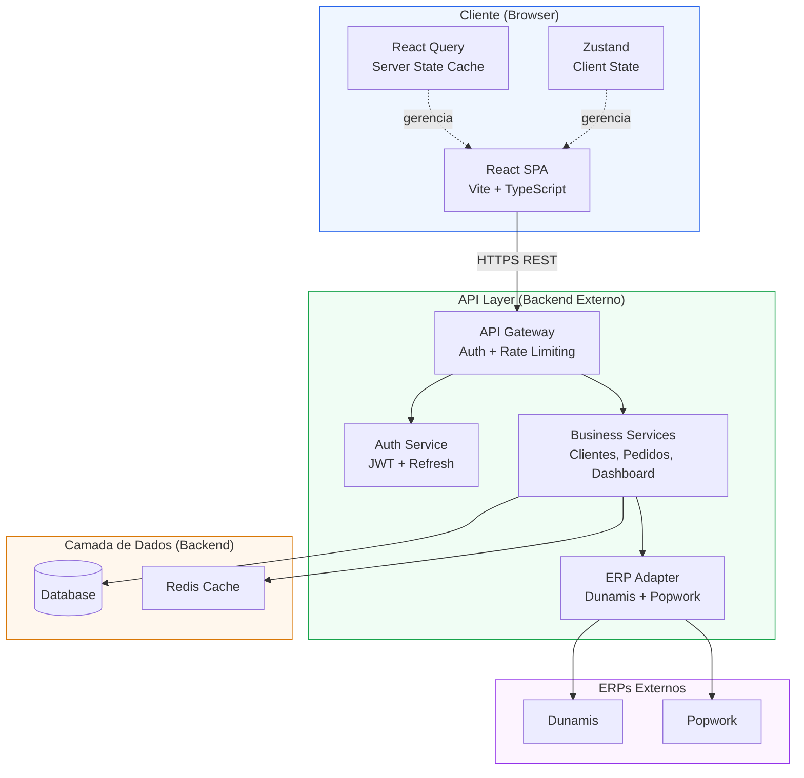
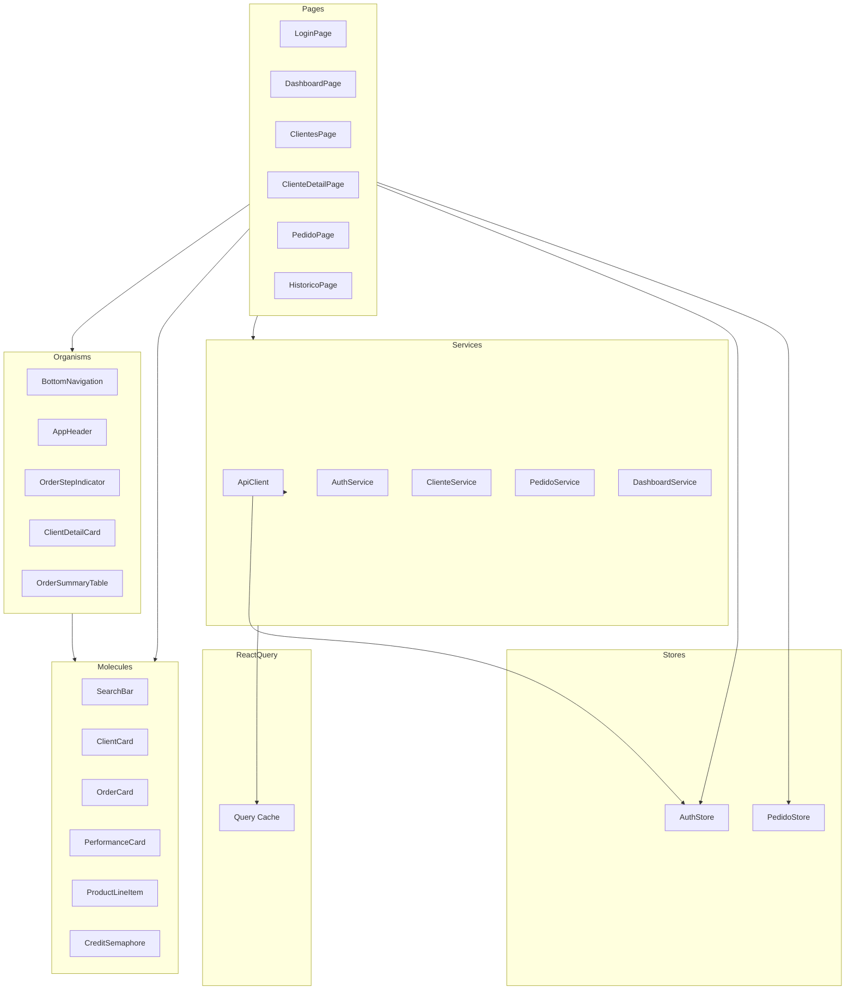
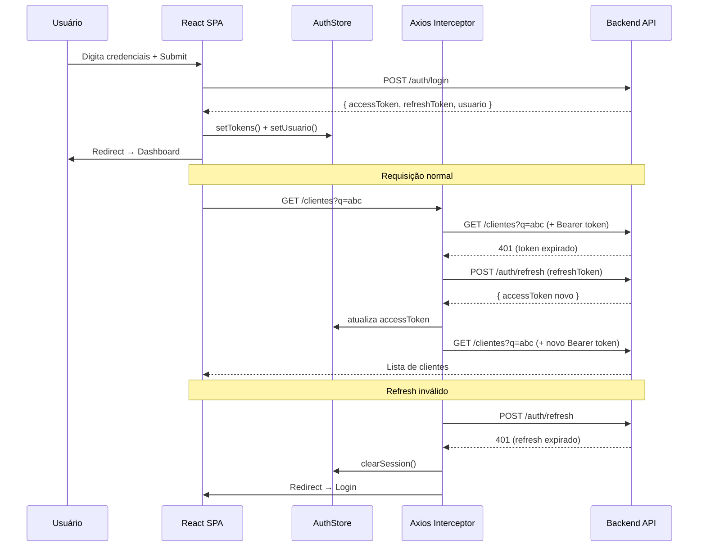
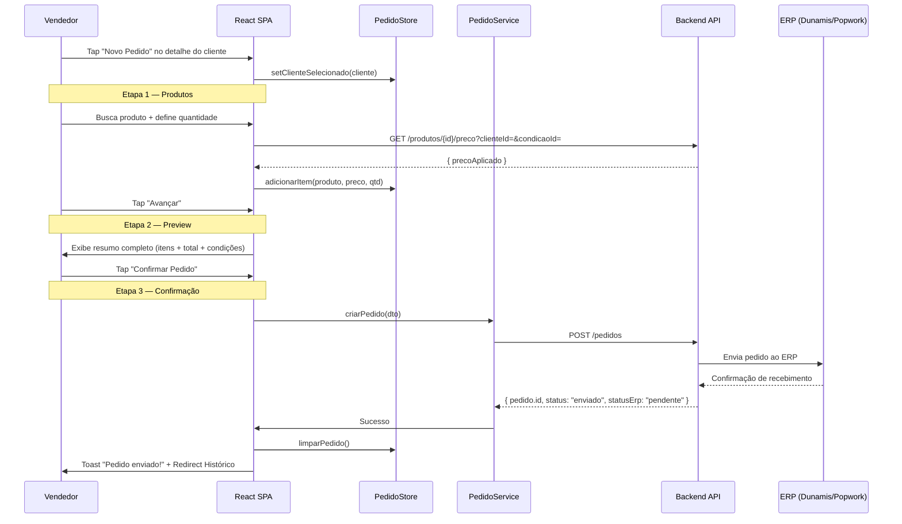
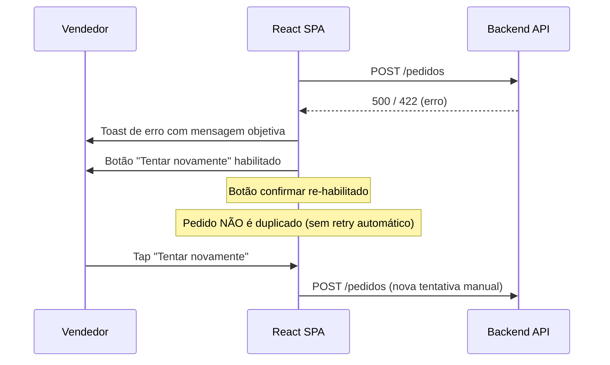
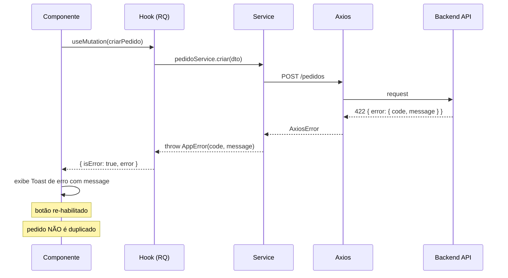

# App do Vendedor — Fullstack Architecture Document

---

## Change Log

| Date | Version | Description | Author |
|------|---------|-------------|--------|
| 2026-03-20 | 1.0 | Criação inicial da arquitetura técnica | @architect (Aria) |

---

## 1. Introduction

Este documento define a arquitetura técnica completa do **App do Vendedor**, cobrindo o frontend React, os contratos de API consumidos, os padrões de autenticação JWT, a estratégia de state management e a integração ERP via backend. Serve como fonte única de verdade técnica para o desenvolvimento, complementando o PRD (`docs/prd.md`) e a especificação de UI/UX (`docs/front-end-spec.md`).

### Starter Template

N/A — Greenfield project. Projeto inicializado do zero com Vite + React + TypeScript. Sem template externo.

> **Nota de escopo:** O backend (API Layer) e a integração direta com banco de dados são responsabilidade de outro time. Este documento define os contratos de API esperados pelo frontend e a arquitetura da aplicação React.

---

## 2. High Level Architecture

### Technical Summary

O App do Vendedor é uma SPA (Single Page Application) construída com React 18 + TypeScript, utilizando Vite como build tool e Tailwind CSS para estilização. Toda comunicação com dados ocorre via camada de APIs REST (backend externo), nunca com acesso direto ao banco de dados. A autenticação é baseada em JWT com refresh token silencioso gerenciado pelo frontend. O state management é dividido em duas camadas: React Query para estado do servidor (cache, fetching, invalidação) e Zustand para estado local da aplicação (UI, sessão, fluxo de pedido). A aplicação opera exclusivamente online, sem Service Workers ou mecanismos de cache persistente.

### Platform and Infrastructure

**Frontend:**
- **Plataforma:** Vercel (recomendado) ou qualquer CDN estático
- **Build:** Vite → `dist/` estático
- **Deployment:** CI/CD automático via GitHub Actions → Vercel

**Backend (externo, fora do escopo de implementação):**
- API REST com endpoints documentados neste arquivo
- Gerencia autenticação JWT, regras de negócio, integração ERP
- Base URL configurável via variável de ambiente

**Ambientes:**

| Environment | Frontend URL | Backend Base URL | Purpose |
|-------------|-------------|-----------------|---------|
| Development | `http://localhost:5173` | `http://localhost:3000/api` | Local dev |
| Staging | `https://staging.appvendedor.com` | `https://api-staging.appvendedor.com` | Pre-prod |
| Production | `https://app.appvendedor.com` | `https://api.appvendedor.com` | Produção |

### Repository Structure

**Estrutura:** Monorepo com npm workspaces

```
app-vendedor/
├── apps/
│   └── web/                          # Frontend SPA (React + Vite)
├── packages/
│   └── shared/                       # Tipos TypeScript compartilhados
├── docs/                             # Documentação do projeto
│   ├── prd.md
│   ├── front-end-spec.md
│   └── architecture.md
├── .github/
│   └── workflows/
│       ├── ci.yaml
│       └── deploy.yaml
├── package.json                      # Root workspaces config
└── README.md
```

### High Level Architecture Diagram



### Architectural Patterns

- **SPA com API-First:** Frontend desacoplado — toda operação de dados via REST API. _Rationale:_ Segurança (front nunca acessa banco), governança de dados, separação de responsabilidades
- **BFF implícito:** O backend expõe endpoints otimizados para o consumo do frontend (não endpoints genéricos de banco). _Rationale:_ Reduz overfetching, simplifica o frontend
- **Server State + Client State separation:** React Query para dados do servidor, Zustand para estado da UI. _Rationale:_ Evita duplicação, garante cache automático, invalidação precisa
- **Optimistic Updates:** Feedback imediato ao usuário antes da confirmação da API (ex: adição de produto no pedido). _Rationale:_ UX fluida em campo
- **Protected Routes:** HOC/wrapper de rota que verifica token JWT antes de renderizar. _Rationale:_ Segurança no acesso a telas autenticadas
- **Service Layer:** Toda chamada HTTP isolada em módulos de serviço (`/services`). _Rationale:_ Testabilidade, centralização de lógica de API, fácil mock em testes
- **Atomic Design:** Componentes organizados em atoms → molecules → organisms (conforme front-end-spec). _Rationale:_ Reutilização, manutenibilidade

---

## 3. Tech Stack

| Category | Technology | Version | Purpose | Rationale |
|----------|-----------|---------|---------|-----------|
| Frontend Language | TypeScript | 5.x | Type safety em todo o frontend | Reduz bugs em runtime, IntelliSense, contratos de API tipados |
| Frontend Framework | React | 18.x | UI declarativa e componentizada | Ecossistema maduro, hooks, concurrent features |
| Build Tool | Vite | 5.x | Dev server + build otimizado | Hot reload instantâneo, build rápido, config mínima |
| CSS Framework | Tailwind CSS | 3.x | Estilização utility-first | Design system via tokens, sem CSS customizado ad-hoc |
| Server State | React Query (TanStack) | 5.x | Cache, fetching, sync com API | Gerencia loading/error/cache automaticamente |
| Client State | Zustand | 4.x | Estado local da aplicação | Leve, sem boilerplate, API simples |
| Routing | React Router DOM | 6.x | SPA routing + protected routes | Padrão de mercado, nested routes, loaders |
| HTTP Client | Axios | 1.x | Chamadas HTTP para a API | Interceptors para JWT refresh, cancelamento, tipagem |
| Icons | Lucide React | latest | Biblioteca de ícones | Leve, tree-shakeable, consistente com front-end-spec |
| Form Management | React Hook Form | 7.x | Formulários (login, pedido) | Performance (sem re-render por campo), validação integrada |
| Validation | Zod | 3.x | Validação de schemas e formulários | Type inference, integração com React Hook Form |
| Testing (unit) | Vitest | 1.x | Testes unitários de componentes | Nativo Vite, API compatível com Jest, rápido |
| Testing (component) | React Testing Library | 14.x | Testes de componentes React | Foco em comportamento do usuário, não implementação |
| E2E Testing | Playwright | 1.x | Testes end-to-end dos fluxos | Cross-browser, confiável, API moderna |
| Linting | ESLint | 8.x | Qualidade de código | Regras TypeScript + React |
| Formatting | Prettier | 3.x | Formatação consistente | Zero configuração, integra com ESLint |
| CI/CD | GitHub Actions | — | Pipeline de CI/CD | Integrado ao repositório, gratuito para projetos |
| Deployment | Vercel | — | Hosting do SPA | Deploy automático por branch, CDN global |
| Error Tracking | Sentry | 7.x | Monitoramento de erros em produção | SDK React, rastreamento de sessão, alertas |

---

## 4. Data Models (TypeScript Interfaces)

> Definidas em `packages/shared/src/types/` — importadas tanto pelo frontend quanto pelo backend (se TypeScript).

### Usuario

**Purpose:** Usuário autenticado (vendedor ou supervisor)

```typescript
// packages/shared/src/types/usuario.ts
export interface Usuario {
  id: string;
  nome: string;
  email: string;
  perfil: 'vendedor' | 'supervisor' | 'admin';
  meta: number;           // Meta mensal em R$
  carteiraIds: string[];  // IDs dos clientes da carteira
}

export interface AuthTokens {
  accessToken: string;    // JWT — curta duração (15min)
  refreshToken: string;   // Refresh — longa duração (7d)
  expiresIn: number;      // Segundos até expiração do access token
}

export interface LoginCredentials {
  email: string;
  senha: string;
}
```

**Relationships:**
- Um `Usuario` possui uma carteira de `Cliente[]`
- Um `Usuario` tem `Pedido[]` associados

---

### Cliente

**Purpose:** Cliente/empresa do vendedor com dados comerciais e financeiros

```typescript
// packages/shared/src/types/cliente.ts
export type StatusCliente = 'ativo' | 'inativo' | 'bloqueado';
export type StatusCredito = 'disponivel' | 'limitado' | 'bloqueado';

export interface Cliente {
  id: string;
  nome: string;
  razaoSocial: string;
  cnpj: string;
  status: StatusCliente;
  limiteCredito: number;
  saldoCredito: number;
  statusCredito: StatusCredito;  // Calculado pelo backend
  pendenciasFinanceiras: number; // Valor total em aberto
  condicoesComerciais: CondicaoComercial[];
}

export interface CondicaoComercial {
  id: string;
  descricao: string;
  tabelaPrecoId: string;
  prazoEntrega: number; // dias
}

export interface HistoricoCompra {
  pedidoId: string;
  data: string;        // ISO 8601
  valorTotal: number;
  status: string;
}
```

**Relationships:**
- `Cliente` possui `CondicaoComercial[]` aplicáveis
- `Cliente` possui `HistoricoCompra[]`

---

### Produto

**Purpose:** Produto disponível para venda com preço e regras promocionais

```typescript
// packages/shared/src/types/produto.ts
export interface Produto {
  id: string;
  codigo: string;
  descricao: string;
  unidade: string;
  precoBase: number;
  estoque?: number;     // Opcional — depende da API
}

export interface ProdutoComPreco extends Produto {
  precoAplicado: number;  // Preço após regras comerciais do cliente
  desconto?: number;      // % de desconto aplicado
  tabelaPrecoId: string;
}
```

---

### Pedido

**Purpose:** Pedido comercial criado pelo vendedor

```typescript
// packages/shared/src/types/pedido.ts
export type StatusPedido = 'em_edicao' | 'enviado' | 'processado' | 'erro_envio';
export type StatusErp = 'pendente' | 'integrado' | 'falha';

export interface ItemPedido {
  produtoId: string;
  codigo: string;
  descricao: string;
  quantidade: number;
  precoUnitario: number;
  subtotal: number;
}

export interface Pedido {
  id: string;
  clienteId: string;
  clienteNome: string;
  vendedorId: string;
  itens: ItemPedido[];
  valorTotal: number;
  condicaoComercialId: string;
  status: StatusPedido;
  statusErp: StatusErp;
  criadoEm: string;    // ISO 8601
  enviadoEm?: string;
}

export interface CriarPedidoDTO {
  clienteId: string;
  condicaoComercialId: string;
  itens: {
    produtoId: string;
    quantidade: number;
  }[];
}
```

---

### Dashboard

**Purpose:** Dados de performance do vendedor

```typescript
// packages/shared/src/types/dashboard.ts
export interface DashboardVendedor {
  vendedorId: string;
  mes: string;           // YYYY-MM
  metaMensal: number;
  totalVendido: number;
  percentualMeta: number;
  totalPedidos: number;
  ultimaAtualizacao: string; // ISO 8601
}
```

---

## 5. API Specification

> Base URL: `${VITE_API_BASE_URL}` (configurável por ambiente)
> Todos os endpoints (exceto auth) requerem header: `Authorization: Bearer {accessToken}`

```yaml
openapi: 3.0.0
info:
  title: App do Vendedor API
  version: 1.0.0
  description: API REST consumida pelo frontend do App do Vendedor

servers:
  - url: https://api.appvendedor.com
    description: Production
  - url: https://api-staging.appvendedor.com
    description: Staging
  - url: http://localhost:3000
    description: Local development

paths:
  # === AUTH ===
  /auth/login:
    post:
      summary: Autenticar vendedor
      requestBody:
        content:
          application/json:
            schema:
              properties:
                email: { type: string }
                senha: { type: string }
      responses:
        200:
          description: Tokens JWT retornados
          content:
            application/json:
              schema:
                properties:
                  accessToken: { type: string }
                  refreshToken: { type: string }
                  expiresIn: { type: number }
                  usuario: { $ref: '#/components/schemas/Usuario' }
        401:
          description: Credenciais inválidas

  /auth/refresh:
    post:
      summary: Renovar access token via refresh token
      requestBody:
        content:
          application/json:
            schema:
              properties:
                refreshToken: { type: string }
      responses:
        200:
          description: Novo access token
        401:
          description: Refresh token inválido ou expirado

  /auth/logout:
    post:
      summary: Invalidar refresh token
      security:
        - bearerAuth: []

  /auth/reset-senha:
    post:
      summary: Solicitar reset de senha
      requestBody:
        content:
          application/json:
            schema:
              properties:
                email: { type: string }

  # === CLIENTES ===
  /clientes:
    get:
      summary: Buscar clientes por nome ou CNPJ
      security:
        - bearerAuth: []
      parameters:
        - name: q
          in: query
          description: Nome parcial ou CNPJ
          required: true
          schema: { type: string, minLength: 2 }
        - name: page
          in: query
          schema: { type: integer, default: 1 }
        - name: limit
          in: query
          schema: { type: integer, default: 20 }
      responses:
        200:
          description: Lista paginada de clientes

  /clientes/{id}:
    get:
      summary: Detalhe do cliente com contexto comercial completo
      security:
        - bearerAuth: []
      responses:
        200:
          description: Cliente com crédito, pendências e condições

  /clientes/{id}/historico:
    get:
      summary: Histórico de compras do cliente
      security:
        - bearerAuth: []
      parameters:
        - name: limit
          in: query
          schema: { type: integer, default: 10 }

  # === PRODUTOS ===
  /produtos:
    get:
      summary: Buscar produtos
      security:
        - bearerAuth: []
      parameters:
        - name: q
          in: query
          description: Nome ou código do produto
          schema: { type: string }

  /produtos/{id}/preco:
    get:
      summary: Obter preço do produto para o cliente específico
      security:
        - bearerAuth: []
      parameters:
        - name: clienteId
          in: query
          required: true
          schema: { type: string }
        - name: condicaoComercialId
          in: query
          required: true
          schema: { type: string }

  # === PEDIDOS ===
  /pedidos:
    post:
      summary: Criar e enviar pedido
      security:
        - bearerAuth: []
      requestBody:
        content:
          application/json:
            schema:
              $ref: '#/components/schemas/CriarPedidoDTO'
      responses:
        201:
          description: Pedido criado e enviado ao ERP
        422:
          description: Validação falhou (item sem estoque, preço inválido, etc.)
        409:
          description: Pedido duplicado detectado

    get:
      summary: Listar pedidos do vendedor autenticado
      security:
        - bearerAuth: []
      parameters:
        - name: status
          in: query
          schema:
            type: string
            enum: [em_edicao, enviado, processado, erro_envio]
        - name: page
          in: query
          schema: { type: integer, default: 1 }

  /pedidos/{id}:
    get:
      summary: Detalhe do pedido com status ERP
      security:
        - bearerAuth: []

  # === DASHBOARD ===
  /dashboard:
    get:
      summary: Dados de performance do vendedor autenticado
      security:
        - bearerAuth: []
      parameters:
        - name: mes
          in: query
          description: Mês no formato YYYY-MM (default current month)
          schema: { type: string }
```

---

## 6. Components

### Frontend Components

#### AuthService
**Responsibility:** Gerenciar autenticação JWT — login, logout, refresh silencioso, persistência de tokens

**Key Interfaces:**
- `login(credentials): Promise<AuthTokens>`
- `logout(): Promise<void>`
- `refreshAccessToken(): Promise<string>`
- `getAccessToken(): string | null`

**Dependencies:** Axios, Zustand (authStore)

**Technology:** `apps/web/src/services/auth.service.ts`

---

#### ApiClient
**Responsibility:** Instância Axios configurada com interceptors de autenticação e refresh automático

**Key Interfaces:**
- Interceptor de request: injeta `Authorization: Bearer {token}`
- Interceptor de response: detecta 401, executa refresh, reenvia request original
- Fila de requests durante refresh (evita múltiplos refreshes simultâneos)

**Technology:** `apps/web/src/services/api-client.ts`

---

#### ClienteService
**Responsibility:** Operações de dados de clientes via API

**Key Interfaces:**
- `buscarClientes(query): Promise<PaginatedResult<Cliente>>`
- `obterDetalhe(id): Promise<ClienteDetalhe>`
- `obterHistorico(id): Promise<HistoricoCompra[]>`

**Dependencies:** ApiClient

---

#### PedidoService
**Responsibility:** Criação, envio e consulta de pedidos

**Key Interfaces:**
- `criarPedido(dto): Promise<Pedido>`
- `listarPedidos(filtros): Promise<PaginatedResult<Pedido>>`
- `obterPedido(id): Promise<Pedido>`
- `obterPreco(produtoId, clienteId, condicaoId): Promise<ProdutoComPreco>`

**Dependencies:** ApiClient

---

#### AuthStore (Zustand)
**Responsibility:** Estado de autenticação local — usuário, tokens, status de sessão

**Key Interfaces:**
- `usuario: Usuario | null`
- `isAuthenticated: boolean`
- `setTokens(tokens): void`
- `clearSession(): void`

---

#### PedidoStore (Zustand)
**Responsibility:** Estado do pedido em criação (rascunho antes do envio)

**Key Interfaces:**
- `clienteSelecionado: Cliente | null`
- `itens: ItemPedidoRascunho[]`
- `adicionarItem(produto, quantidade): void`
- `removerItem(produtoId): void`
- `atualizarQuantidade(produtoId, quantidade): void`
- `limparPedido(): void`

---

#### Component Diagram



---

## 7. External APIs

### Backend API (App do Vendedor API)

- **Purpose:** Fonte de todos os dados — clientes, produtos, pedidos, dashboard
- **Base URL:** `${VITE_API_BASE_URL}`
- **Authentication:** JWT Bearer token (access token, 15min) + Refresh token (7d)
- **Rate Limits:** A definir pelo time de backend

**Key Endpoints Used:**
- `POST /auth/login` — Autenticação
- `POST /auth/refresh` — Renovação de token
- `GET /clientes?q=` — Busca de clientes
- `GET /clientes/{id}` — Detalhe do cliente
- `GET /produtos?q=` — Busca de produtos
- `GET /produtos/{id}/preco?clienteId=&condicaoComercialId=` — Preço por cliente
- `POST /pedidos` — Criar pedido (envia ao ERP via backend)
- `GET /pedidos` — Listar pedidos do vendedor
- `GET /dashboard` — Performance do vendedor

**Integration Notes:** O frontend nunca chama os ERPs diretamente. O `POST /pedidos` retorna após o backend ter encaminhado ao ERP. O status de integração ERP é retornado em `pedido.statusErp`.

---

## 8. Core Workflows

### Workflow 1 — Autenticação com Refresh Silencioso



---

### Workflow 2 — Criação de Pedido (3 Etapas)



---

### Workflow 3 — Tratamento de Erro de Envio



---

## 9. Frontend Architecture

### Component Architecture

#### Project Structure

```
apps/web/
├── src/
│   ├── components/
│   │   ├── atoms/
│   │   │   ├── Button/
│   │   │   │   ├── Button.tsx
│   │   │   │   └── Button.test.tsx
│   │   │   ├── Input/
│   │   │   ├── Badge/
│   │   │   ├── CreditSemaphore/
│   │   │   └── Toast/
│   │   ├── molecules/
│   │   │   ├── SearchBar/
│   │   │   ├── ClientCard/
│   │   │   ├── OrderCard/
│   │   │   ├── PerformanceCard/
│   │   │   └── ProductLineItem/
│   │   └── organisms/
│   │       ├── BottomNavigation/
│   │       ├── AppHeader/
│   │       ├── OrderStepIndicator/
│   │       ├── ClientDetailCard/
│   │       └── OrderSummaryTable/
│   ├── pages/
│   │   ├── Login/
│   │   ├── Dashboard/
│   │   ├── Clientes/
│   │   │   ├── ClientesPage.tsx
│   │   │   └── ClienteDetailPage.tsx
│   │   ├── Pedido/
│   │   │   ├── PedidoStep1.tsx
│   │   │   ├── PedidoStep2.tsx
│   │   │   └── PedidoStep3.tsx
│   │   └── Historico/
│   ├── services/
│   │   ├── api-client.ts         # Axios instance + interceptors
│   │   ├── auth.service.ts
│   │   ├── cliente.service.ts
│   │   ├── pedido.service.ts
│   │   ├── produto.service.ts
│   │   └── dashboard.service.ts
│   ├── stores/
│   │   ├── auth.store.ts         # Zustand: usuário + tokens
│   │   └── pedido.store.ts       # Zustand: rascunho de pedido
│   ├── hooks/
│   │   ├── useAuth.ts
│   │   ├── useClientes.ts        # React Query hooks
│   │   ├── usePedidos.ts
│   │   └── useDashboard.ts
│   ├── router/
│   │   ├── index.tsx             # React Router v6 config
│   │   └── ProtectedRoute.tsx
│   ├── types/                    # Re-exports de packages/shared
│   ├── utils/
│   │   ├── formatters.ts         # formatCurrency, formatCNPJ, etc.
│   │   └── validators.ts
│   ├── config/
│   │   └── env.ts                # NUNCA usar process.env direto
│   ├── main.tsx
│   └── App.tsx
├── public/
├── tests/
│   └── e2e/
├── index.html
├── vite.config.ts
├── tailwind.config.ts
└── package.json
```

#### Component Template

```typescript
// Padrão de componente React com TypeScript
import { type FC } from 'react'

interface ButtonProps {
  variant?: 'primary' | 'secondary' | 'danger' | 'ghost'
  size?: 'sm' | 'md' | 'lg'
  isLoading?: boolean
  disabled?: boolean
  onClick?: () => void
  children: React.ReactNode
}

export const Button: FC<ButtonProps> = ({
  variant = 'primary',
  size = 'md',
  isLoading = false,
  disabled = false,
  onClick,
  children,
}) => {
  const baseClasses = 'inline-flex items-center justify-center font-medium rounded-lg transition-colors focus:outline-none focus:ring-2 focus:ring-blue-600 focus:ring-offset-2 min-h-[44px]'

  const variantClasses = {
    primary: 'bg-blue-600 text-white hover:bg-blue-700 disabled:bg-blue-300',
    secondary: 'border border-slate-300 text-slate-700 hover:bg-slate-50 disabled:opacity-50',
    danger: 'bg-red-600 text-white hover:bg-red-700 disabled:bg-red-300',
    ghost: 'text-blue-600 hover:bg-blue-50 disabled:opacity-50',
  }

  return (
    <button
      className={`${baseClasses} ${variantClasses[variant]}`}
      disabled={disabled || isLoading}
      onClick={onClick}
      aria-busy={isLoading}
    >
      {isLoading ? <span className="animate-spin mr-2">⏳</span> : null}
      {children}
    </button>
  )
}
```

---

### State Management Architecture

#### Auth Store (Zustand)

```typescript
// stores/auth.store.ts
import { create } from 'zustand'
import { persist } from 'zustand/middleware'
import type { Usuario, AuthTokens } from '@app-vendedor/shared'

interface AuthState {
  usuario: Usuario | null
  accessToken: string | null
  refreshToken: string | null
  isAuthenticated: boolean
  setSession: (tokens: AuthTokens, usuario: Usuario) => void
  setAccessToken: (token: string) => void
  clearSession: () => void
}

export const useAuthStore = create<AuthState>()(
  persist(
    (set) => ({
      usuario: null,
      accessToken: null,
      refreshToken: null,
      isAuthenticated: false,

      setSession: (tokens, usuario) => set({
        accessToken: tokens.accessToken,
        refreshToken: tokens.refreshToken,
        usuario,
        isAuthenticated: true,
      }),

      setAccessToken: (token) => set({ accessToken: token }),

      clearSession: () => set({
        usuario: null,
        accessToken: null,
        refreshToken: null,
        isAuthenticated: false,
      }),
    }),
    {
      name: 'auth-store',
      // Apenas refreshToken persiste no localStorage
      // accessToken é mantido apenas em memória (mais seguro)
      partialize: (state) => ({ refreshToken: state.refreshToken }),
    }
  )
)
```

#### Pedido Store (Zustand)

```typescript
// stores/pedido.store.ts
import { create } from 'zustand'
import type { Cliente, ProdutoComPreco } from '@app-vendedor/shared'

interface ItemRascunho {
  produto: ProdutoComPreco
  quantidade: number
  subtotal: number
}

interface PedidoState {
  clienteSelecionado: Cliente | null
  condicaoComercialId: string | null
  itens: ItemRascunho[]
  valorTotal: number
  setCliente: (cliente: Cliente, condicaoId: string) => void
  adicionarItem: (produto: ProdutoComPreco, quantidade: number) => void
  atualizarQuantidade: (produtoId: string, quantidade: number) => void
  removerItem: (produtoId: string) => void
  limparPedido: () => void
}

export const usePedidoStore = create<PedidoState>()((set, get) => ({
  clienteSelecionado: null,
  condicaoComercialId: null,
  itens: [],
  valorTotal: 0,

  setCliente: (cliente, condicaoId) => set({
    clienteSelecionado: cliente,
    condicaoComercialId: condicaoId,
    itens: [],
    valorTotal: 0,
  }),

  adicionarItem: (produto, quantidade) => {
    const subtotal = produto.precoAplicado * quantidade
    set((state) => {
      const itens = [...state.itens, { produto, quantidade, subtotal }]
      return { itens, valorTotal: itens.reduce((sum, i) => sum + i.subtotal, 0) }
    })
  },

  atualizarQuantidade: (produtoId, quantidade) => {
    set((state) => {
      const itens = state.itens.map((item) =>
        item.produto.id === produtoId
          ? { ...item, quantidade, subtotal: item.produto.precoAplicado * quantidade }
          : item
      )
      return { itens, valorTotal: itens.reduce((sum, i) => sum + i.subtotal, 0) }
    })
  },

  removerItem: (produtoId) => {
    set((state) => {
      const itens = state.itens.filter((i) => i.produto.id !== produtoId)
      return { itens, valorTotal: itens.reduce((sum, i) => sum + i.subtotal, 0) }
    })
  },

  limparPedido: () => set({
    clienteSelecionado: null,
    condicaoComercialId: null,
    itens: [],
    valorTotal: 0,
  }),
}))
```

---

### Routing Architecture

```typescript
// router/index.tsx
import { createBrowserRouter, RouterProvider } from 'react-router-dom'
import { ProtectedRoute } from './ProtectedRoute'
import { AppLayout } from '@/components/organisms/AppLayout'

const router = createBrowserRouter([
  {
    path: '/login',
    element: <LoginPage />,
  },
  {
    path: '/reset-senha',
    element: <ResetSenhaPage />,
  },
  {
    path: '/',
    element: (
      <ProtectedRoute>
        <AppLayout />   {/* Contém BottomNavigation + AppHeader */}
      </ProtectedRoute>
    ),
    children: [
      { index: true, element: <Navigate to="/dashboard" replace /> },
      { path: 'dashboard', element: <DashboardPage /> },
      { path: 'clientes', element: <ClientesPage /> },
      { path: 'clientes/:id', element: <ClienteDetailPage /> },
      { path: 'pedidos/novo', element: <PedidoPage /> },
      { path: 'historico', element: <HistoricoPage /> },
      { path: 'historico/:id', element: <PedidoDetailPage /> },
    ],
  },
])

// ProtectedRoute
// router/ProtectedRoute.tsx
export const ProtectedRoute: FC<{ children: ReactNode }> = ({ children }) => {
  const { isAuthenticated } = useAuthStore()
  if (!isAuthenticated) return <Navigate to="/login" replace />
  return <>{children}</>
}
```

---

### API Client + Interceptors

```typescript
// services/api-client.ts
import axios, { type AxiosInstance } from 'axios'
import { useAuthStore } from '@/stores/auth.store'
import { env } from '@/config/env'

let isRefreshing = false
let failedQueue: Array<{ resolve: (token: string) => void; reject: (err: unknown) => void }> = []

const processQueue = (error: unknown, token: string | null = null) => {
  failedQueue.forEach((prom) => {
    if (error) prom.reject(error)
    else prom.resolve(token!)
  })
  failedQueue = []
}

export const apiClient: AxiosInstance = axios.create({
  baseURL: env.API_BASE_URL,
  timeout: 15000,
  headers: { 'Content-Type': 'application/json' },
})

// Request interceptor — injeta access token
apiClient.interceptors.request.use((config) => {
  const token = useAuthStore.getState().accessToken
  if (token) config.headers.Authorization = `Bearer ${token}`
  return config
})

// Response interceptor — refresh silencioso em 401
apiClient.interceptors.response.use(
  (response) => response,
  async (error) => {
    const original = error.config

    if (error.response?.status === 401 && !original._retry) {
      if (isRefreshing) {
        return new Promise((resolve, reject) => {
          failedQueue.push({ resolve, reject })
        }).then((token) => {
          original.headers.Authorization = `Bearer ${token}`
          return apiClient(original)
        })
      }

      original._retry = true
      isRefreshing = true

      const refreshToken = useAuthStore.getState().refreshToken

      try {
        const { data } = await axios.post(`${env.API_BASE_URL}/auth/refresh`, { refreshToken })
        useAuthStore.getState().setAccessToken(data.accessToken)
        processQueue(null, data.accessToken)
        original.headers.Authorization = `Bearer ${data.accessToken}`
        return apiClient(original)
      } catch (refreshError) {
        processQueue(refreshError)
        useAuthStore.getState().clearSession()
        window.location.href = '/login'
        return Promise.reject(refreshError)
      } finally {
        isRefreshing = false
      }
    }

    return Promise.reject(error)
  }
)
```

---

### React Query Hooks

```typescript
// hooks/useClientes.ts
import { useQuery } from '@tanstack/react-query'
import { clienteService } from '@/services/cliente.service'

export const queryKeys = {
  clientes: {
    search: (q: string) => ['clientes', 'search', q] as const,
    detail: (id: string) => ['clientes', 'detail', id] as const,
    historico: (id: string) => ['clientes', 'historico', id] as const,
  },
  pedidos: {
    list: (filtros?: object) => ['pedidos', 'list', filtros] as const,
    detail: (id: string) => ['pedidos', 'detail', id] as const,
  },
  dashboard: {
    current: () => ['dashboard'] as const,
  },
}

export const useClienteSearch = (query: string) =>
  useQuery({
    queryKey: queryKeys.clientes.search(query),
    queryFn: () => clienteService.buscar(query),
    enabled: query.length >= 2,
    staleTime: 1000 * 60 * 5, // 5 min
  })

export const useClienteDetail = (id: string) =>
  useQuery({
    queryKey: queryKeys.clientes.detail(id),
    queryFn: () => clienteService.obterDetalhe(id),
    staleTime: 1000 * 60 * 2, // 2 min
  })
```

---

## 10. Unified Project Structure

```
app-vendedor/
├── .github/
│   └── workflows/
│       ├── ci.yaml               # lint + typecheck + tests
│       └── deploy.yaml           # deploy para Vercel
├── apps/
│   └── web/                      # SPA React
│       ├── src/
│       │   ├── components/       # Atomic Design
│       │   ├── pages/
│       │   ├── services/
│       │   ├── stores/
│       │   ├── hooks/
│       │   ├── router/
│       │   ├── utils/
│       │   ├── config/
│       │   ├── main.tsx
│       │   └── App.tsx
│       ├── tests/e2e/            # Playwright
│       ├── index.html
│       ├── vite.config.ts
│       ├── tailwind.config.ts
│       ├── tsconfig.json
│       └── package.json
├── packages/
│   └── shared/                   # Tipos TypeScript compartilhados
│       ├── src/
│       │   └── types/
│       │       ├── usuario.ts
│       │       ├── cliente.ts
│       │       ├── produto.ts
│       │       ├── pedido.ts
│       │       ├── dashboard.ts
│       │       └── index.ts
│       ├── tsconfig.json
│       └── package.json
├── docs/
│   ├── prd.md
│   ├── front-end-spec.md
│   └── architecture.md
├── .env.example
├── package.json                  # Root — npm workspaces
└── README.md
```

---

## 11. Development Workflow

### Prerequisites

```bash
node --version    # >= 20.x LTS
npm --version     # >= 10.x
git --version
```

### Initial Setup

```bash
git clone {repo-url} app-vendedor
cd app-vendedor
npm install               # Instala todos os workspaces
cp .env.example apps/web/.env.local
# Editar .env.local com a URL da API
```

### Development Commands

```bash
# Iniciar frontend em dev mode
npm run dev --workspace=apps/web

# Build de produção
npm run build --workspace=apps/web

# Rodar todos os testes unitários
npm run test --workspace=apps/web

# Rodar testes E2E
npm run test:e2e --workspace=apps/web

# Lint
npm run lint --workspace=apps/web

# Typecheck
npm run typecheck --workspace=apps/web

# Typecheck de todos os packages
npm run typecheck --workspaces
```

### Environment Configuration

```bash
# apps/web/.env.local (desenvolvimento local)
VITE_API_BASE_URL=http://localhost:3000/api

# apps/web/.env.production (produção — configurado no Vercel)
VITE_API_BASE_URL=https://api.appvendedor.com

# Regra: NUNCA usar import.meta.env diretamente no código
# Sempre usar: import { env } from '@/config/env'
# apps/web/src/config/env.ts valida e exporta as variáveis
```

```typescript
// apps/web/src/config/env.ts
const env = {
  API_BASE_URL: import.meta.env.VITE_API_BASE_URL as string,
  SENTRY_DSN: import.meta.env.VITE_SENTRY_DSN as string,
}

if (!env.API_BASE_URL) {
  throw new Error('VITE_API_BASE_URL is required')
}

export { env }
```

---

## 12. Deployment Architecture

### Deployment Strategy

**Frontend:**
- **Platform:** Vercel
- **Build Command:** `npm run build --workspace=apps/web`
- **Output Directory:** `apps/web/dist`
- **CDN/Edge:** Vercel Edge Network (global CDN automático)
- **Preview Deployments:** Automático por Pull Request

**Backend (externo):**
- Gerenciado pelo time de backend
- URLs configuradas via variáveis de ambiente por ambiente

### CI/CD Pipeline

```yaml
# .github/workflows/ci.yaml
name: CI

on:
  push:
    branches: [main, develop]
  pull_request:
    branches: [main]

jobs:
  quality:
    runs-on: ubuntu-latest
    steps:
      - uses: actions/checkout@v4
      - uses: actions/setup-node@v4
        with:
          node-version: '20'
          cache: 'npm'
      - run: npm ci
      - run: npm run lint --workspace=apps/web
      - run: npm run typecheck --workspaces
      - run: npm run test --workspace=apps/web

  e2e:
    runs-on: ubuntu-latest
    needs: quality
    steps:
      - uses: actions/checkout@v4
      - uses: actions/setup-node@v4
        with:
          node-version: '20'
          cache: 'npm'
      - run: npm ci
      - run: npx playwright install --with-deps
      - run: npm run test:e2e --workspace=apps/web
        env:
          VITE_API_BASE_URL: ${{ secrets.STAGING_API_URL }}
```

---

## 13. Security and Performance

### Security Requirements

**Frontend Security:**
- **Token Storage:** `accessToken` em memória (variável de módulo, não localStorage). `refreshToken` em `localStorage` com chave obscurecida
- **XSS Prevention:** React escapa output automaticamente. Evitar `dangerouslySetInnerHTML`. CSP headers configurados no Vercel
- **HTTPS Only:** `VITE_API_BASE_URL` sempre HTTPS em staging/produção
- **Sensitive data:** Dados financeiros não armazenados no frontend além do ciclo de vida da query (React Query TTL)
- **Double-submit prevention:** Botão de confirmar pedido desabilitado após primeiro tap (NFR7)

**Authentication Security:**
- JWT access token com expiração curta (15min)
- Refresh token rotacionado a cada uso (implementação no backend)
- Logout invalida refresh token no backend (`DELETE /auth/logout`)
- Interceptor de fila evita múltiplos refreshes simultâneos

**Frontend Security Headers (Vercel `vercel.json`):**
```json
{
  "headers": [
    {
      "source": "/(.*)",
      "headers": [
        { "key": "X-Content-Type-Options", "value": "nosniff" },
        { "key": "X-Frame-Options", "value": "DENY" },
        { "key": "X-XSS-Protection", "value": "1; mode=block" },
        { "key": "Referrer-Policy", "value": "strict-origin-when-cross-origin" }
      ]
    }
  ]
}
```

### Performance Optimization

**Frontend Performance:**
- **Bundle Size Target:** < 300kb gzipped (initial load)
- **Code Splitting:** React.lazy + Suspense por página (route-based splitting)
- **React Query Cache:** `staleTime` por tipo de dado (clientes: 5min, dashboard: 2min, preços: 1min)
- **Debounce:** Busca de clientes e produtos com 300ms de debounce
- **Virtualization:** `react-virtual` para listas longas de pedidos (> 50 itens)
- **Image optimization:** Sem imagens críticas no MVP — apenas ícones SVG (Lucide, tree-shakeable)
- **Skeleton loaders:** Em todos os fetches para evitar layout shift (CLS = 0)

---

## 14. Testing Strategy

### Testing Pyramid

```
           ┌─────────────────────┐
           │     E2E (Playwright)│  ← Fluxos críticos completos
           │   ~10 testes        │
           └─────────────────────┘
         ┌───────────────────────────┐
         │  Integration Tests         │  ← Service layer + React Query hooks
         │  ~30 testes                │
         └───────────────────────────┘
    ┌───────────────────────────────────┐
    │     Unit Tests (Vitest + RTL)     │  ← Componentes, utils, stores
    │     ~100+ testes                  │
    └───────────────────────────────────┘
```

### Test Organization

```
apps/web/
├── src/
│   └── components/atoms/Button/
│       ├── Button.tsx
│       └── Button.test.tsx        # Co-located unit tests
├── tests/
│   ├── integration/
│   │   ├── auth.test.ts           # Auth flow com MSW mock
│   │   ├── cliente.test.ts
│   │   └── pedido.test.ts
│   └── e2e/
│       ├── login.spec.ts
│       ├── busca-cliente.spec.ts
│       └── criar-pedido.spec.ts
```

### Test Examples

#### Unit — Componente CreditSemaphore

```typescript
// CreditSemaphore.test.tsx
import { render, screen } from '@testing-library/react'
import { CreditSemaphore } from './CreditSemaphore'

describe('CreditSemaphore', () => {
  it('exibe verde quando saldo > 30% do limite', () => {
    render(<CreditSemaphore saldo={5000} limite={10000} status="disponivel" />)
    expect(screen.getByText('Disponível')).toBeInTheDocument()
    expect(screen.getByRole('status')).toHaveClass('text-green-600')
  })

  it('exibe amarelo quando status é limitado', () => {
    render(<CreditSemaphore saldo={1500} limite={10000} status="limitado" />)
    expect(screen.getByText('Limitado')).toBeInTheDocument()
  })

  it('exibe vermelho quando status é bloqueado', () => {
    render(<CreditSemaphore saldo={0} limite={10000} status="bloqueado" />)
    expect(screen.getByText('Bloqueado')).toBeInTheDocument()
  })

  it('status não é comunicado apenas por cor (acessibilidade)', () => {
    render(<CreditSemaphore saldo={0} limite={10000} status="bloqueado" />)
    expect(screen.getByText('Bloqueado')).toBeVisible()
  })
})
```

#### E2E — Fluxo de Pedido Completo

```typescript
// tests/e2e/criar-pedido.spec.ts
import { test, expect } from '@playwright/test'

test('vendedor cria e confirma pedido em 3 etapas', async ({ page }) => {
  await page.goto('/login')
  await page.fill('[name=email]', 'vendedor@test.com')
  await page.fill('[name=senha]', 'senha123')
  await page.click('button[type=submit]')

  await page.waitForURL('/dashboard')

  await page.click('[data-testid=nav-clientes]')
  await page.fill('[data-testid=search-bar]', 'Empresa ABC')
  await page.click('[data-testid=client-card]:first-child')

  await expect(page.locator('[data-testid=credit-semaphore]')).toBeVisible()
  await page.click('[data-testid=btn-novo-pedido]')

  // Etapa 1
  await page.fill('[data-testid=search-produto]', 'Produto X')
  await page.click('[data-testid=add-produto]:first-child')
  await expect(page.locator('[data-testid=total]')).toContainText('R$')
  await page.click('[data-testid=btn-avancar]')

  // Etapa 2
  await expect(page.locator('[data-testid=order-preview]')).toBeVisible()
  await page.click('[data-testid=btn-confirmar]')

  // Etapa 3
  await page.click('[data-testid=btn-confirmar-enviar]')
  await expect(page.locator('[data-testid=toast-sucesso]')).toBeVisible()
  await page.waitForURL('/historico')
})
```

---

## 15. Coding Standards

### Critical Rules

- **Type Sharing:** Sempre definir tipos em `packages/shared/src/types/` e importar de lá — nunca redefinir no frontend
- **API Calls:** Nunca fazer chamadas HTTP diretamente nos componentes — sempre usar hooks React Query que chamam o service layer
- **Environment Variables:** Acessar apenas via `import { env } from '@/config/env'` — nunca `import.meta.env.XXX` espalhado pelo código
- **Error Handling:** Todos os erros de API devem ser tratados no hook ou service — componente apenas exibe o estado de erro
- **State mutations:** Nunca mutar estado Zustand diretamente — sempre usar as actions definidas na store
- **Token access:** Acessar tokens apenas via `useAuthStore` — nunca ler localStorage diretamente em componentes
- **No direct bank access:** O frontend NUNCA deve ter lógica que tente acessar banco — apenas chamadas para `env.API_BASE_URL`

### Naming Conventions

| Element | Pattern | Example |
|---------|---------|---------|
| Components | PascalCase | `CreditSemaphore.tsx` |
| Hooks | camelCase com `use` | `useClienteSearch.ts` |
| Services | camelCase + `.service.ts` | `cliente.service.ts` |
| Stores | camelCase + `.store.ts` | `pedido.store.ts` |
| Pages | PascalCase + `Page` | `ClienteDetailPage.tsx` |
| API Routes | kebab-case | `/api/clientes/{id}` |
| Query Keys | objeto tipado em `queryKeys` | `queryKeys.clientes.detail(id)` |
| Test files | mesmo nome + `.test.tsx` | `Button.test.tsx` |
| E2E files | descritivo + `.spec.ts` | `criar-pedido.spec.ts` |

---

## 16. Error Handling Strategy

### Error Flow



### Error Response Format

```typescript
// packages/shared/src/types/errors.ts
export interface ApiError {
  error: {
    code: string;       // Ex: 'PEDIDO_DUPLICADO', 'CREDITO_INSUFICIENTE'
    message: string;    // Mensagem legível para o usuário
    details?: Record<string, unknown>;
    timestamp: string;
    requestId: string;
  }
}

export class AppError extends Error {
  constructor(
    public code: string,
    public userMessage: string,
    public originalError?: unknown,
  ) {
    super(userMessage)
    this.name = 'AppError'
  }
}
```

### Frontend Error Handling

```typescript
// services/pedido.service.ts — tratamento padronizado
import { type AppError } from '@app-vendedor/shared'
import { apiClient } from './api-client'

const ERROR_MESSAGES: Record<string, string> = {
  PEDIDO_DUPLICADO: 'Este pedido já foi enviado anteriormente.',
  CREDITO_INSUFICIENTE: 'Cliente sem limite de crédito disponível.',
  PRODUTO_SEM_ESTOQUE: 'Um ou mais produtos estão sem estoque.',
  VALIDATION_ERROR: 'Verifique os dados do pedido e tente novamente.',
  DEFAULT: 'Ocorreu um erro ao enviar o pedido. Tente novamente.',
}

export const pedidoService = {
  async criar(dto: CriarPedidoDTO): Promise<Pedido> {
    try {
      const { data } = await apiClient.post<Pedido>('/pedidos', dto)
      return data
    } catch (error) {
      if (axios.isAxiosError(error) && error.response?.data?.error) {
        const apiErr = error.response.data.error
        const msg = ERROR_MESSAGES[apiErr.code] ?? ERROR_MESSAGES.DEFAULT
        throw new AppError(apiErr.code, msg, error)
      }
      throw new AppError('UNKNOWN', ERROR_MESSAGES.DEFAULT, error)
    }
  },
}
```

---

## 17. Monitoring and Observability

### Monitoring Stack

- **Frontend Error Tracking:** Sentry SDK para React (captura erros JS, performance, sessões)
- **Performance Monitoring:** Sentry Performance + Web Vitals (LCP, CLS, FID)
- **API Response Times:** Monitorado via React Query DevTools em dev; Sentry em produção
- **Backend Monitoring:** Responsabilidade do time de backend

### Key Metrics

**Frontend Metrics (Sentry + Web Vitals):**
- LCP (Largest Contentful Paint): target < 3s
- CLS (Cumulative Layout Shift): target < 0.1
- Erros JavaScript por sessão
- Taxa de sucesso de criação de pedidos
- Tempo médio de resposta das chamadas de API

**Business Metrics (via logs da API):**
- Pedidos criados por dia
- Taxa de erro no envio de pedidos
- Tempo médio de integração ERP

---

## 18. Checklist Results

| Item | Status | Observação |
|------|--------|------------|
| Arquitetura API-first documentada | ✅ | Front nunca acessa banco — apenas `API_BASE_URL` |
| JWT + Refresh silencioso especificado | ✅ | Interceptor com fila de requests, clearSession em falha |
| Integração ERP documentada | ✅ | Via `POST /pedidos` → backend → ERP (Dunamis/Popwork) |
| Stack definida com versões | ✅ | React 18, Vite 5, Tailwind 3, RQ 5, Zustand 4 |
| Tipos TypeScript compartilhados | ✅ | `packages/shared` — fonte única de verdade |
| State management arquitetado | ✅ | React Query (server) + Zustand (client) separados |
| Protected Routes definidas | ✅ | `ProtectedRoute` wrapper com redirect para /login |
| Estratégia de testes definida | ✅ | Unit (Vitest/RTL) + Integration + E2E (Playwright) |
| Segurança de tokens documentada | ✅ | Access em memória, refresh em localStorage |
| Double-submit prevention | ✅ | Botão desabilitado após primeiro tap |
| Sem PWA / Service Worker | ✅ | Online-only confirmado — sem SW registrado |
| Monorepo estruturado | ✅ | npm workspaces: apps/web + packages/shared |
| CI/CD definido | ✅ | GitHub Actions → Vercel |
| Error handling padronizado | ✅ | AppError + ERROR_MESSAGES por código |
| Coding standards definidos | ✅ | 7 regras críticas + naming conventions |
